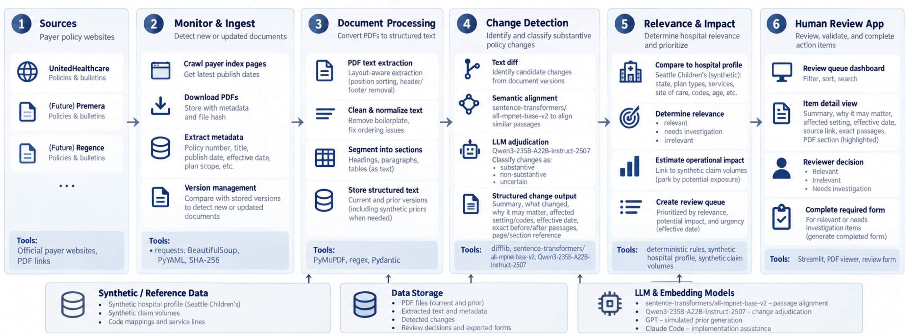
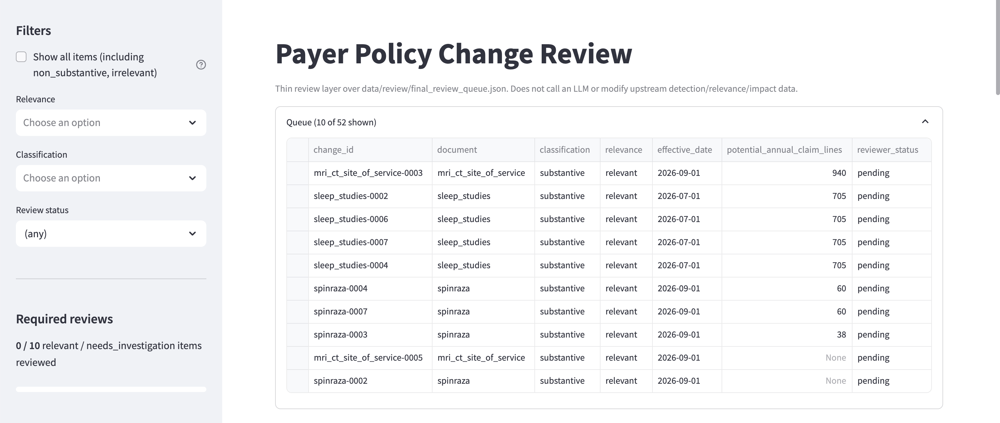
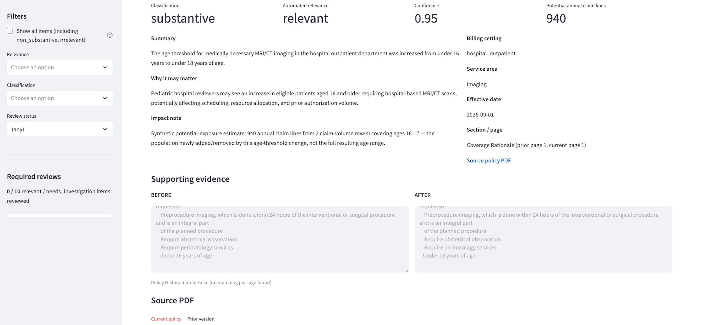

# Payer Policy Monitor

Prototype for turning payer policy updates into an evidence-backed review queue for a
pediatric hospital.

The project demonstrates an end-to-end workflow for:

1. collecting payer policy documents and source metadata,
2. identifying newly published or changed policies,
3. detecting substantive policy changes rather than formatting-only changes,
4. assessing likely relevance to a synthetic pediatric hospital profile,
5. estimating potential exposure using synthetic claim volumes, and
6. presenting prioritized changes in a lightweight human review application.

The prototype currently focuses on UnitedHealthcare Commercial policies and uses only
public payer documents and synthetic hospital/claim data.

- **`docs/payer_policy_submission_working_notes.md`** — direct answers to the
  submission prompts: policies/links, date handling, relevance methodology,
  performance + a false-positive/ambiguous case, AI use/confidentiality, next steps.
- **`docs/RUNNING_GUIDE.md`** — exact step-by-step reproduction commands.

## 1. Problem

Payer policy monitoring is difficult because a newly published PDF does not necessarily
mean that an actionable coverage rule changed. A reviewer needs to answer: Did the
payer publish a new version? What changed? Was it substantive or just
administrative/formatting? Does it apply to our geography, plan, population, or
billing setting? How many claims might be exposed? 

This prototype separates those questions into distinct pipeline stages rather than
asking one model to solve the entire problem end-to-end.

## 2. Architecture



AI interprets source evidence, but does not create the evidence. Source URLs, dates, page numbers, and exact before/after passages are retained from the deterministic document pipeline; model-generated summaries and interpretations are layered on top of them.

## 3. Source Selection

Five public UnitedHealthcare Commercial documents:


| Document                                                    | Type                        | Role                                                       |
| ----------------------------------------------------------- | --------------------------- | ---------------------------------------------------------- |
| MRI and CT Scan – Site of Service                          | Medical Policy              | Change-detection example; site-of-care/pediatric relevance |
| Spinraza (Nusinersen)                                       | Medical Benefit Drug Policy | Change-detection example; authorization/treatment rules    |
| Sleep Studies                                               | Medical Policy              | Change-detection example; multiple substantive revisions   |
| Allergen Testing Policy, Professional and Facility          | Reimbursement Policy        | Billing-setting/age-scope example                          |
| August 2026 Commercial Reimbursement Policy Update Bulletin | Update bulletin             | Publication/event-level metadata example                   |

- https://www.uhcprovider.com/content/dam/provider/docs/public/policies/comm-medical-drug/mri-ct-scan-site-of-service.pdf
- https://www.uhcprovider.com/content/dam/provider/docs/public/policies/comm-medical-drug/spinraza-nusinersen.pdf
- https://www.uhcprovider.com/content/dam/provider/docs/public/policies/comm-medical-drug/sleep-studies.pdf
- https://www.uhcprovider.com/content/dam/provider/docs/public/policies/comm-reimbursement/COMM-Allergen-Testing-Policy.pdf
- https://www.uhcprovider.com/content/dam/provider/docs/public/policies/comm-reimbursement/rpub/UHC-COMM-RPUB-August-2026.pdf

MRI/CT, Spinraza, and Sleep Studies got the full prior/current comparison. Their
revision histories referenced prior versions that couldn't be reliably retrieved from
the live site, so we use clearly labeled `SIMULATED PRIOR VERSION — NOT AN ORIGINAL PAYER ARTIFACT` fixtures for those three, reverted from the current policy using the payer's own revision-history language (details: `docs/SIMULATED_PRIORS_README.md`, submission notes §1).

## 4. How It Works

**Collection** is deterministic: HTTP retrieval → PDF validation → hash the exact
bytes → page-level text extraction → explicit metadata only. Four date concepts
(effective, revision, publication, index `Last Published`) are kept separate rather
than collapsed into one — see submission notes §2 for how missing/conflicting dates
are handled.

**Change detection** is a three-stage hybrid, not one LLM call over the whole
document: deterministic diffing discovers every textual difference (favoring recall);
a local `sentence-transformers/all-mpnet-base-v2` model aligns which prior passage
corresponds to which current one when a block is ambiguous — it never decides
substantive-ness, and high similarity never suppresses a candidate ("under 16" vs.
"under 18" score 0.94+ similar and still surface); `Qwen/Qwen3-235B-A22B-Instruct-2507`
classifies each candidate as `substantive`/`non_substantive`/`uncertain` from the exact
before/after text and extracts the structured fields relevance needs, in the same
call. The payer's revision-history section is checked as corroborating evidence, never
as an exhaustive list — a deliberately unlisted MRI/CT age-threshold change is still
found and correctly classified.

> **Result: 9/9 recall** against the hand-built ground truth for every payer-documented
> change across the three test policies — plus the one deliberately *undocumented*
> change (found independent of revision history) and exactly one identified false
> positive, traced to a fixture-construction artifact rather than the detector. Full
> breakdown: submission notes §4.

**Relevance** runs only on substantive/uncertain candidates, comparing structured
fields (`service_area`, `billing_setting`, `age`, `codes`, `states`, `plan_scope`) against a synthetic hospital profile
(`config/synthetic_hospital_profile.yaml`). Output is a conservative three-way
`relevant`/`irrelevant`/`needs_investigation`, and codes are used when present but
never required (submission notes §3).

**Synthetic claim-volume impact** runs on relevant/needs-investigation items only,
using a strict matching cascade against `data/synthetic_claim_volume.csv` (explicit
plan → explicit code → newly-affected age band → service-area proxy, each clearly
labeled) — never a dollar estimate, never a silent fallback to a broader number.

**The reviewer app** (`app.py`, `streamlit run app.py`) is a thin layer over
`data/review/final_review_queue.json`: browse/filter the queue, inspect exact
before/after evidence and the source PDF, and record a `Relevant`/`Irrelevant`/`Needs investigation` decision — kept separate from the automated `relevance` field.
Substantive items with automated relevance `relevant`/`needs_investigation` are
required before the completed review can be submitted.



*The same age-threshold example from the callout above, open in `app.py`: summary,
why it may matter, the 940-claim-line synthetic impact estimate, the exact
before/after evidence side by side, and the source PDF tab.*

## 5. Engineering Decisions

- **Deterministic monitoring before LLM analysis.** Hashing, dates, source URLs, and
  document identity don't need an LLM.
- **Hybrid semantic detection.** Embeddings match passages; they don't decide
  significance.
- **Revision history is corroboration, not ground truth.** Undocumented changes can
  still be detected.
- **One LLM pass.** The same Qwen call classifies the change and extracts the
  structured fields relevance needs downstream.
- **Exact evidence is immutable.** LLM output never replaces the original
  before/after text.
- **Relevance is separate from change detection.** A real policy change may still be
  irrelevant to a particular hospital.
- **Impact is conservative.** Synthetic matched volume is potential exposure, not a
  guaranteed affected-claim count.
- **Human review is final.**

## 6. Limitations

- Historical payer PDFs were unavailable, requiring clearly labeled simulated priors,
  which can themselves introduce extraction artifacts (submission notes §4).
- The synthetic hospital profile and claim volumes are illustrative, not Seattle
  Children's actual contracts, claims, or plan mix.
- No dollar amounts are estimated anywhere in the pipeline, by design.
- QC is currently manual over a small dataset — see submission notes §6 for what a
  larger evaluation set and model benchmarking would look like before deployment.

## 7. Repository Structure

```text
config/            sources.yaml, synthetic_hospital_profile.yaml
data/
    raw/, processed/                       real UHC PDFs + metadata
    simulated_prior_raw/, simulated_prior_processed/
    change_results/                        frozen historical QC snapshot
    review/                                current pipeline output + completed reviews
    synthetic_claim_volume.csv
scripts/           collect.py, process_simulated_priors.py, detect_changes.py,
                   review_processing.py, build_*_workbook.py (QC helpers, no LLM)
src/payer_policy/  ...
tests/             ...
app.py
```

## 8. Running It

```
python -m venv .venv && source .venv/bin/activate && pip install -r requirements.txt
python scripts/collect.py && python scripts/process_simulated_priors.py
HF_TOKEN='hf_...' python scripts/detect_changes.py
python scripts/review_processing.py
pytest tests/
streamlit run app.py
```

Full explanation of each step, expected output, and troubleshooting:
`docs/RUNNING_GUIDE.md`.
