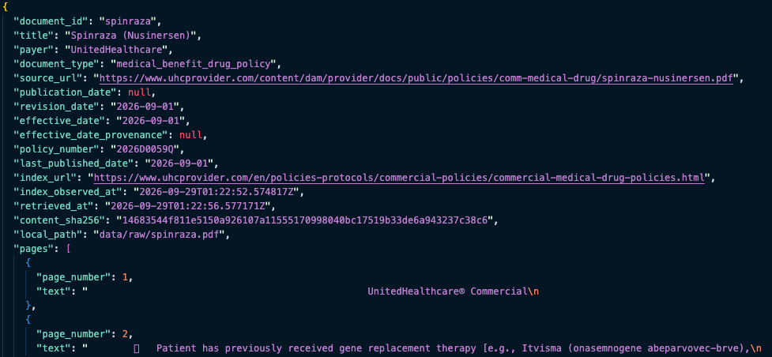

# Payer Policy Monitor

Prototype for turning payer policy updates into an evidence-backed review queue for a
pediatric hospital.

The project demonstrates an end-to-end workflow for:

1. collecting payer policy documents and source metadata,
2. identifying newly published or changed policies,
3. detecting substantive policy changes rather than formatting-only changes,
4. assessing likely relevance to a synthetic pediatric hospital profile,
5. estimating potential exposure using synthetic claim volumes, and
6. presenting prioritized changes in a lightweight human review application.

The prototype currently focuses on UnitedHealthcare Commercial policies and uses only
public payer documents and synthetic hospital/claim data.

- **`docs/payer_policy_submission_working_notes.md`** — answers to the
  submission prompts.
- **`docs/RUNNING_GUIDE.md`** — reproduction commands.
- Loom walkthrough & demo: https://www.loom.com/share/3e4c4c8d621d4ab5aa6447da46424f47

## 1. Problem

Payer policy monitoring is difficult because a newly published PDF does not necessarily
mean that an actionable coverage rule changed. A reviewer needs to answer: Did the
payer publish a new version? What changed? Was it substantive or just
administrative/formatting? Does it apply to our geography, plan, population, or
billing setting? How many claims might be exposed?

This prototype separates those questions into distinct pipeline stages rather than
asking one model to solve the entire problem end-to-end.

## 2. Architecture


Source URLs, dates, page numbers, and exact before/after passages are retained from the deterministic document pipeline; model-generated summaries and interpretations are layered on top of them.

## 3. Source Selection

Five public UnitedHealthcare Commercial documents:


| Document                                                    | Type                        | Role                                                       |
| ----------------------------------------------------------- | --------------------------- | ---------------------------------------------------------- |
| MRI and CT Scan – Site of Service                          | Medical Policy              | Change-detection example; site-of-care/pediatric relevance |
| Spinraza (Nusinersen)                                       | Medical Benefit Drug Policy | Change-detection example; authorization/treatment rules    |
| Sleep Studies                                               | Medical Policy              | Change-detection example; multiple substantive revisions   |
| Allergen Testing Policy, Professional and Facility          | Reimbursement Policy        | Billing-setting/age-scope example                          |
| August 2026 Commercial Reimbursement Policy Update Bulletin | Update bulletin             | Publication/event-level metadata example                   |

- https://www.uhcprovider.com/content/dam/provider/docs/public/policies/comm-medical-drug/mri-ct-scan-site-of-service.pdf
- https://www.uhcprovider.com/content/dam/provider/docs/public/policies/comm-medical-drug/spinraza-nusinersen.pdf
- https://www.uhcprovider.com/content/dam/provider/docs/public/policies/comm-medical-drug/sleep-studies.pdf
- https://www.uhcprovider.com/content/dam/provider/docs/public/policies/comm-reimbursement/COMM-Allergen-Testing-Policy.pdf
- https://www.uhcprovider.com/content/dam/provider/docs/public/policies/comm-reimbursement/rpub/UHC-COMM-RPUB-August-2026.pdf

MRI/CT, Spinraza, and Sleep Studies got the full prior/current comparison. Their
revision histories referenced prior versions that couldn't be reliably retrieved from
the live site, so we use clearly labeled `SIMULATED PRIOR VERSION — NOT AN ORIGINAL PAYER ARTIFACT` fixtures for those three, reverted from the current policy using the payer's own revision-history language (details: `docs/SIMULATED_PRIORS_README.md`, submission notes §1).
Allergen Testing and the bulletin were collected but not run through change detection:
Allergen Testing has no Policy History/revision-date section at all, so there's no
documented revision to revert into a simulated prior.
The bulletin itself is a periodic announcement, not a versioned policy, so
prior/current comparison doesn't apply to it the same way.

## 4. How It Works & Example Ouputs

**Collection** is deterministic: HTTP retrieval → PDF validation → hash the exact
bytes → page-level text extraction → explicit metadata only. Four date concepts
(effective, revision, publication, index `Last Published`) are kept separate.



**Change detection** is a three-stage hybrid, not one LLM call over the whole
document: deterministic diffing discovers every textual difference (favoring recall);
a local `sentence-transformers/all-mpnet-base-v2` model aligns which prior passage
corresponds to which current one when a block is ambiguous ("under 16" vs.
"under 18" score 0.94+ similar and still surface); `Qwen/Qwen3-235B-A22B-Instruct-2507`
classifies each candidate as `substantive`/`non_substantive`/`uncertain` from the exact
before/after text and extracts the structured fields relevance needs, in the same
call. The payer's revision-history section is checked as corroborating evidence, and a deliberately unlisted MRI/CT age-threshold change is still found and correctly classified.

> **Result: 9/9 recall** against the hand-built ground truth for every payer-documented
> change across the three test policies — plus the one deliberately *undocumented*
> change (found independent of revision history) and exactly one identified false
> positive, traced to a fixture-construction artifact rather than the detector.

Full breakdown, checked against `tests/fixtures/SIMULATED_PRIORS_GROUND_TRUTH.json`
and `data/review/final_review_queue.json`:

- **9/9 documented changes correctly classified `substantive`** — 2 in MRI/CT
  (Individual Exchange Illinois exclusion, CPT 70471 added), 2 in Spinraza (Itvisma
  added to gene-therapy examples, loading-dose authorization language), 5 in Sleep
  Studies (technically-inadequate criterion removed, RBD wording, PAP-titration
  criterion broadened, repeat-testing clause added, cardiovascular-disease clause
  removed).
- **1 additional undocumented change found**: the MRI/CT age threshold (Under 16 →
  Under 18) was deliberately left out of the simulated prior's revision history to
  test whether detection depends on it — it was still found and classified
  `substantive`, `revision_history_match: false`. Reported separately since there's no
  ground-truth entry for it to "recall" against.
- **1 false positive**: `spinraza-0002` ("Changed 'On' to 'One of the following:'...")
  is classified `substantive` with no corresponding ground-truth entry at all. Its
  prior-version text contains a bare fragment — `a; and` — that isn't valid English on
  its own, pointing to a truncation artifact in how that simulated-prior fixture was
  built rather than a detector bug. Left visible rather than tuned around.
- **Policy History corroboration under-performs classification recall**: only 4 of the
  9 documented changes actually got `revision_history_match: true`. Root cause: Sleep
  Studies nests four separate changes under sub-headings ("Other Conditions",
  "Attended PAP Titration", "Attended Repeat Testing") the history splitter doesn't
  recognize as boundaries, so they collapse into one 3,000+ character history entry.
  Semantic similarity against that entry is still strong (0.66-0.76) for the missed
  candidates, but the lexical-overlap half of the dual similarity+lexical threshold drops to 0.04-0.09
  because a short quote gets diluted against a much longer, multi-topic blob.
  Classification succeeds independently from the before/after text either way, so this
  doesn't cost recall, but the reviewer-facing "Policy History confirms this" citation
  is missing on roughly half the cases where it should be there. Noted, not fixed due to time contraint.

**Relevance** runs only on substantive/uncertain candidates, comparing structured
fields (`service_area`, `billing_setting`, `age`, `codes`, `states`, `plan_scope`) against a synthetic hospital profile
(`config/synthetic_hospital_profile.yaml`). Output is a conservative three-way
`relevant`/`irrelevant`/`needs_investigation`, and codes are used when present but
never required (submission notes §3).

**Synthetic claim-volume impact** runs on relevant/needs-investigation items only,
using a strict matching cascade against `data/synthetic_claim_volume.csv` (explicit
plan → explicit code → newly-affected age band → service-area proxy, each clearly
labeled).

Three full rows from `data/review/final_review_queue.json`, chosen to show three
different outcomes:

**`mri_ct_site_of_service-0002`** — substantive, but irrelevant to this hospital


| Field                          | Value                                                                                                                                                                                                                        |
| ------------------------------ | ---------------------------------------------------------------------------------------------------------------------------------------------------------------------------------------------------------------------------- |
| classification                 | `substantive`                                                                                                                                                                                                                |
| change_type / section          | `modified` / Application                                                                                                                                                                                                     |
| before_text                    | "UnitedHealthcare Individual Exchange<br>This Medical Policy applies to Individual Exchange benefit plans in all states, except for Maryland, Massachusetts, Texas, and Wisconsin."                                          |
| after_text                     | "UnitedHealthcare Individual Exchange<br>This Medical Policy applies to Individual Exchange benefit plans in all states, except for Illinois, Maryland, Massachusetts, Texas, and Wisconsin."                                |
| summary                        | The policy now explicitly excludes Illinois from the states where this Medical Policy applies for Individual Exchange plans, whereas it previously did not mention Illinois as an exception.                                 |
| reason                         | The addition of Illinois to the list of excluded states changes the geographic applicability of the policy, which affects coverage determinations and billing requirements for services in that state.                       |
| why_it_may_matter              | Pediatric hospital reviewers should be aware that MRI and CT scan coverage rules under Individual Exchange plans may differ in Illinois compared to other states, potentially affecting authorization and billing processes. |
| billing_setting / service_area | `hospital_outpatient` / `imaging`                                                                                                                                                                                            |
| age_min / age_max              | *(null)* / *(null)*                                                                                                                                                                                                          |
| codes                          | *(none)*                                                                                                                                                                                                                     |
| states                         | `IL`                                                                                                                                                                                                                         |
| plan_scope                     | `individual_exchange`                                                                                                                                                                                                        |
| additional_data_needed         | `site_of_service`, `plan_product`                                                                                                                                                                                            |
| revision_history_match         | `true` — "Application / Individual Exchange / Added language to indicate this Medical Policy does not apply to Individual Exchange benefit plans in the state of Illinois"                                                  |
| confidence                     | 1.0                                                                                                                                                                                                                          |
| effective_date                 | 2026-09-01                                                                                                                                                                                                                   |
| prior/current policy_number    | MP.13.19 → MP.13.20                                                                                                                                                                                                         |
| source_url                     | uhcprovider.com/.../mri-ct-scan-site-of-service.pdf                                                                                                                                                                          |
| relevance                      | `irrelevant`                                                                                                                                                                                                                 |
| relevance_reason               | passage explicitly lists an exclusion of`['IL']` that does not include the hospital's state (WA); this specific change doesn't affect the hospital.                                                                          |
| potential_annual_claim_lines   | *(null)*                                                                                                                                                                                                                     |
| impact_note                    | Not estimated: change assessed as irrelevant to the hospital profile.                                                                                                                                                        |

**`mri_ct_site_of_service-0005`** — substantive, relevant, but no synthetic volume to size it


| Field                          | Value                                                                                                                                                                                                                                                                     |
| ------------------------------ | ------------------------------------------------------------------------------------------------------------------------------------------------------------------------------------------------------------------------------------------------------------------------- |
| classification                 | `substantive`                                                                                                                                                                                                                                                             |
| change_type / section          | `added` / Applicable Codes                                                                                                                                                                                                                                                |
| before_text                    | *(null — this is a pure addition, nothing to diff against)*                                                                                                                                                                                                              |
| after_text                     | "70471   Computed tomographic angiography (CTA), head and neck, with contrast material(s), including noncontrast images, when performed, and image postprocessing"                                                                                                        |
| summary                        | Added CPT code 70471 for computed tomographic angiography (CTA) of the head and neck with contrast, including noncontrast images when performed and image postprocessing.                                                                                                 |
| reason                         | The addition of a new CPT code to the Applicable Codes section explicitly expands the list of billable services under this policy, which affects coverage determination, billing, and potentially reimbursement for this specific imaging service.                        |
| why_it_may_matter              | Pediatric hospital reviewers should be aware that CPT 70471 is now formally included in the policy for MRI/CT site-of-service rules, which may affect authorization requirements and billing practices for head and neck CTA studies in children if clinically indicated. |
| billing_setting / service_area | `hospital_outpatient` / `imaging`                                                                                                                                                                                                                                         |
| age_min / age_max              | *(null)* / *(null)*                                                                                                                                                                                                                                                       |
| codes                          | `70471`                                                                                                                                                                                                                                                                   |
| states / plan_scope            | *(none)* / *(none)*                                                                                                                                                                                                                                                       |
| additional_data_needed         | `clinical_indication`, `site_of_service`                                                                                                                                                                                                                                  |
| revision_history_match         | `true` — "Applicable Codes / Computed Tomography / Added CPT code 70471"                                                                                                                                                                                                 |
| confidence                     | 1.0                                                                                                                                                                                                                                                                       |
| effective_date                 | 2026-09-01                                                                                                                                                                                                                                                                |
| prior/current policy_number    | MP.13.19 → MP.13.20                                                                                                                                                                                                                                                      |
| source_url                     | uhcprovider.com/.../mri-ct-scan-site-of-service.pdf                                                                                                                                                                                                                       |
| relevance                      | `relevant`                                                                                                                                                                                                                                                                |
| relevance_reason               | service_area 'imaging' and billing_setting 'hospital_outpatient' both fall within the hospital's profile, with no conflicting age, plan, or geography signal.                                                                                                             |
| potential_annual_claim_lines   | *(null)*                                                                                                                                                                                                                                                                  |
| impact_note                    | No synthetic claim-volume row exists for code(s)`['70471']`; code-specific volume is unavailable, and broader service-area volume is not used as a substitute.                                                                                                            |

**`mri_ct_site_of_service-0001`** — filtered out before relevance/impact ever run


| Field                                                | Value                                                                                                                                                                                                                  |
| ---------------------------------------------------- | ---------------------------------------------------------------------------------------------------------------------------------------------------------------------------------------------------------------------- |
| classification                                       | `non_substantive`                                                                                                                                                                                                      |
| change_type / section                                | `modified` / *(none — header block, not a policy section)*                                                                                                                                                            |
| before_text                                          | "Policy Number: MP.13.19 / Effective Date: January 1, 2026"                                                                                                                                                            |
| after_text                                           | "Policy Number: MP.13.20 / Effective Date: September 1, 2026"                                                                                                                                                          |
| summary                                              | Update to policy number and effective date.                                                                                                                                                                            |
| reason                                               | The change involves only the policy number (from MP.13.19 to MP.13.20) and the effective date (from January 1, 2026 to September 1, 2026), with no modifications to the policy language or clinical coverage criteria. |
| why_it_may_matter                                    | *(empty — non_substantive candidates get no relevance framing)*                                                                                                                                                       |
| billing_setting / service_area                       | `unknown` / `unknown`                                                                                                                                                                                                  |
| codes / states / plan_scope / additional_data_needed | *(none)*                                                                                                                                                                                                               |
| revision_history_match                               | `true` — "Date / Summary of Changes / 09/01/2026"                                                                                                                                                                     |
| confidence                                           | 1.0                                                                                                                                                                                                                    |
| effective_date                                       | 2026-09-01                                                                                                                                                                                                             |
| prior/current policy_number                          | MP.13.19 → MP.13.20                                                                                                                                                                                                   |
| source_url                                           | uhcprovider.com/.../mri-ct-scan-site-of-service.pdf                                                                                                                                                                    |
| relevance / relevance_reason                         | *(null / null — never assessed)*                                                                                                                                                                                      |
| potential_annual_claim_lines / impact_note           | *(null / null — never estimated)*                                                                                                                                                                                     |

All three are live output, unedited, from
`data/review/final_review_queue.json` and browsable in the app below.

**The reviewer app** (`app.py`, `streamlit run app.py`) is a thin layer over
`data/review/final_review_queue.json`: browse/filter the queue, inspect exact
before/after evidence and the source PDF, and record a `Relevant`/`Irrelevant`/`Needs investigation` decision — kept separate from the automated `relevance` field.
Substantive items with automated relevance `relevant`/`needs_investigation` are
required before the completed review can be submitted.


*The same age-threshold example from the callout above, open in `app.py`: summary,
why it may matter, the 940-claim-line synthetic impact estimate, the exact
before/after evidence side by side, and the source PDF tab.*

**Human reviewer output**, exported from the app to
`data/review/completed_review_summary.csv`. 13 of the 51 rows are shown below —
every `substantive` and `irrelevant` item; the other 38 are `non_substantive`
boilerplate (effective-date-only header/footer edits) and are omitted here for
brevity:


| change_id                     | document_id            | classification    | relevance    | reviewer_decision | reviewer_note | effective_date | potential_annual_claim_lines | summary                                                                                                                                                                                                                                                                                                                                                                                                                |
| ----------------------------- | ---------------------- | ----------------- | ------------ | ----------------- | ------------- | -------------- | ---------------------------- | ---------------------------------------------------------------------------------------------------------------------------------------------------------------------------------------------------------------------------------------------------------------------------------------------------------------------------------------------------------------------------------------------------------------------- |
| `mri_ct_site_of_service-0005` | mri_ct_site_of_service | `substantive`     | `relevant`   | `relevant`        | —            | 9/1/26         | —                           | Added CPT code 70471 for computed tomographic angiography (CTA) of the head and neck with contrast, including noncontrast images when performed and image postprocessing.                                                                                                                                                                                                                                              |
| `mri_ct_site_of_service-0003` | mri_ct_site_of_service | `substantive`     | `relevant`   | `relevant`        | —            | 9/1/26         | 940                          | The age threshold for medically necessary MRI/CT imaging in the hospital outpatient department was increased from under 16 years to under 18 years of age.                                                                                                                                                                                                                                                             |
| `spinraza-0002`               | spinraza               | `substantive`     | `relevant`   | `relevant`        | —            | 9/1/26         | —                           | Changed 'On' to 'One of the following:' in a list of criteria, altering the logical structure of requirements.                                                                                                                                                                                                                                                                                                         |
| `spinraza-0003`               | spinraza               | `substantive`     | `relevant`   | `relevant`        | —            | 9/1/26         | 38                           | Expanded the list of gene replacement therapies by adding Itvisma (onasemnogene abeparvovec-brve) as an example alongside Zolgensma for which prior receipt disqualifies a patient from Spinraza coverage.                                                                                                                                                                                                             |
| `spinraza-0004`               | spinraza               | `substantive`     | `relevant`   | `relevant`        | —            | 9/1/26         | 60                           | The policy now includes an additional gene replacement therapy (Itvisma) by name, requires documentation of functional decline via medical records, and adds a new condition prohibiting planned inpatient admissions solely for Spinraza administration. The initial authorization period is now tied more precisely to FDA-approved dosing regimens, specifying different loading dose counts based on regimen type. |
| `spinraza-0007`               | spinraza               | `substantive`     | `relevant`   | `relevant`        | —            | 9/1/26         | 60                           | Addition of a new condition that the provider must not request a planned inpatient admission solely for Spinraza administration.                                                                                                                                                                                                                                                                                       |
| `sleep_studies-0002`          | sleep_studies          | `substantive`     | `relevant`   | `relevant`        | —            | 7/1/26         | 705                          | Removed 'technically inadequate' as a qualifying criterion for medically necessary attended full-channel polysomnography following a prior HSAT in individuals with suspected OSA.                                                                                                                                                                                                                                     |
| `sleep_studies-0006`          | sleep_studies          | `substantive`     | `relevant`   | `relevant`        | —            | 7/1/26         | 705                          | The condition for a full-night PAP titration study has been broadened from requiring 'inadequate or not feasible split-night study' to allowing it whenever there is a confirmed diagnosis of OSA or other sleep-disordered breathing, regardless of split-night feasibility.                                                                                                                                          |
| `sleep_studies-0007`          | sleep_studies          | `substantive`     | `relevant`   | `relevant`        | —            | 7/1/26         | 705                          | The AFTER version adds a conditional clause requiring that the general criteria for an attended study must first be met before repeat testing is considered medically necessary, and removes 'changes in cardiovascular disease' as a qualifying condition for repeat testing.                                                                                                                                         |
| `sleep_studies-0004`          | sleep_studies          | `substantive`     | `relevant`   | `relevant`        | —            | 7/1/26         | 705                          | Change from 'behaviors suspicious of Rapid Eye Movement Sleep Behavior Disorder (RBD)' to 'behaviors or behaviors suspicious of RBD' broadens the criterion by separating documented disruptive behaviors from those merely suspicious of RBD, potentially expanding coverage.                                                                                                                                         |
| `mri_ct_site_of_service-0002` | mri_ct_site_of_service | `substantive`     | `irrelevant` | —                | —            | 9/1/26         | —                           | The policy now explicitly excludes Illinois from the states where this Medical Policy applies for Individual Exchange plans, whereas it previously did not mention Illinois as an exception.                                                                                                                                                                                                                           |
| `mri_ct_site_of_service-0000` | mri_ct_site_of_service | `non_substantive` | —           | —                | —            | 9/1/26         | —                           | Removal of a simulated prior version banner indicating the document was not an original payer artifact.                                                                                                                                                                                                                                                                                                                |
| `mri_ct_site_of_service-0001` | mri_ct_site_of_service | `non_substantive` | —           | —                | —            | 9/1/26         | —                           | Update to policy number and effective date.                                                                                                                                                                                                                                                                                                                                                                            |

The two
`non_substantive` rows at the bottom (filtered out before relevance/impact ever
run) are included to show what a fully-skipped row looks like end to end.

## 5. Engineering Decisions

- **Deterministic monitoring before LLM analysis.** Hashing, dates, source URLs, and
  document identity don't need an LLM.
- **Hybrid semantic detection.** Embeddings match passages; they don't decide
  significance.
- **Revision history is corroboration, not ground truth.** Undocumented changes can
  still be detected.
- **One LLM pass.** The same Qwen call classifies the change and extracts the
  structured fields relevance needs downstream.
- **Exact evidence is immutable.** LLM output never replaces the original
  before/after text.
- **Relevance is separate from change detection.** A real policy change may still be
  irrelevant to a particular hospital.
- **Impact is conservative.** Synthetic matched volume is potential exposure, not a
  guaranteed affected-claim count.
- **Human review is final.**

## 6. Limitations

- Historical payer PDFs were unavailable, requiring clearly labeled simulated priors,
  which can themselves introduce extraction artifacts.
- Policy History corroboration under-matches on documents whose history section
  nests multiple changes under sub-headings the splitter doesn't recognize (e.g.
  Sleep Studies) — only 4/9 ground-truth changes got `revision_history_match: true`,
  even though all 9 were still correctly classified `substantive` from the text alone.
- The synthetic hospital profile and claim volumes are illustrative, not Seattle
  Children's actual contracts, claims, or plan mix.
- No dollar amounts are estimated anywhere in the pipeline, by design.
- QC is currently manual over a small dataset — see submission notes §6 for what a
  larger evaluation set and model benchmarking would look like before deployment.

## 7. Repository Structure

```text
config/            sources.yaml, synthetic_hospital_profile.yaml
data/
    raw/, processed/                       real UHC PDFs + metadata
    simulated_prior_raw/, simulated_prior_processed/
    change_results/                        frozen historical QC snapshot
    review/                                current pipeline output + completed reviews
    synthetic_claim_volume.csv
scripts/           collect.py, process_simulated_priors.py, detect_changes.py,
                   review_processing.py, build_*_workbook.py (QC helpers, no LLM)
src/payer_policy/  ...
tests/             ...
app.py
```

## 8. Running It

```
python -m venv .venv && source .venv/bin/activate && pip install -r requirements.txt
python scripts/collect.py && python scripts/process_simulated_priors.py
HF_TOKEN='hf_...' python scripts/detect_changes.py
python scripts/review_processing.py
pytest tests/
streamlit run app.py
```

Full explanation of each step, expected output, and troubleshooting:
`docs/RUNNING_GUIDE.md`.
